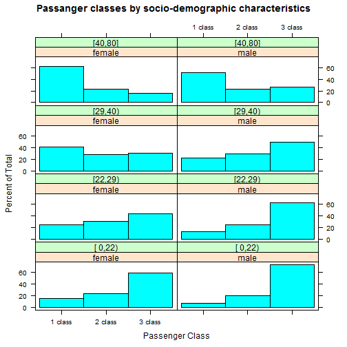
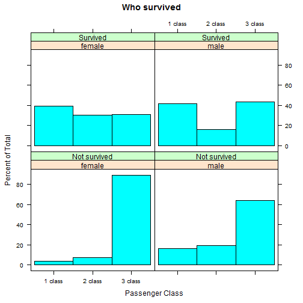

## Why is it interesting?

1. All people have different capabilities and resources to handle difficult situations.
2. This fact lies into the basis of modern society organization: how organized public spaces and transport, for example.
3. And analyzing such a tragic disaster like Titanic destraction helps to prevent them in future.

--- .class #id 

## Some preprocessing

Loading necessary data


```r
test <- titanic_test[,c("Pclass", "Sex", "Age")]
train_all <- titanic_train[,c("Pclass", "Sex", "Age")]
all <- rbind(test, train_all)
all$Age <- round(all$Age, 0)
all$age_groups <- cut2(all$Age, g=4)
all$Sex <- as.factor(all$Sex)
all$Pclass <- as.factor(all$Pclass)
```


--- .class #id 

## Who travelled?



--- .class #id 

## My application
My applications builds GLM binomial model in data presented in titanic dataset.

- Confidence Inteval & Coefficients

```r
exp(confint(fit))
```

```
##                   2.5 %     97.5 %
## (Intercept) 20.37890724 98.3863313
## Age          0.94905346  0.9780124
## Sexmale      0.05293643  0.1194848
## Pclass2      0.15515074  0.4621731
## Pclass3      0.04299250  0.1297997
```

```r
exp(fit$coefficients)
```

```
## (Intercept)         Age     Sexmale     Pclass2     Pclass3 
## 43.68534331  0.96369033  0.08023617  0.26987422  0.07572664
```


--- .class #id 

## Did these charectiristics really influence?


